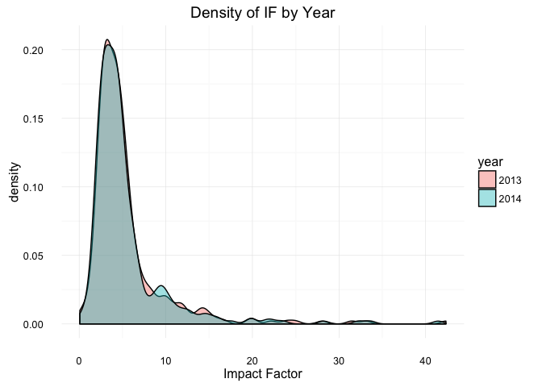
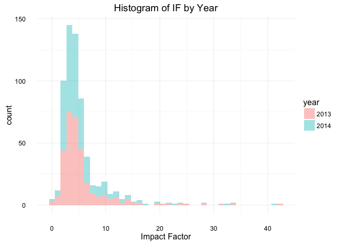
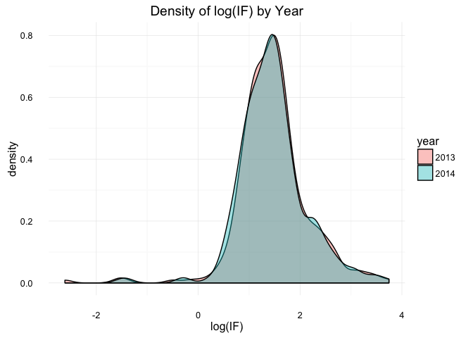
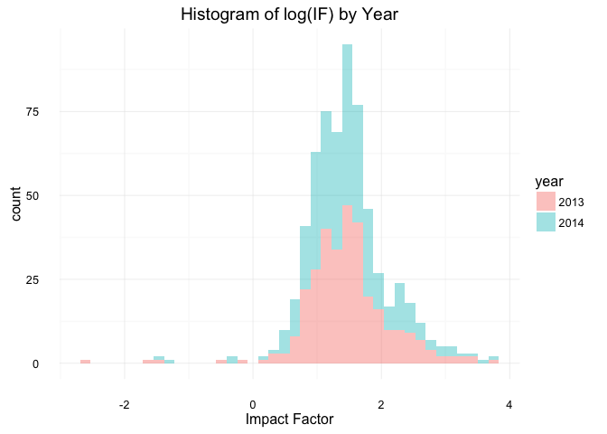
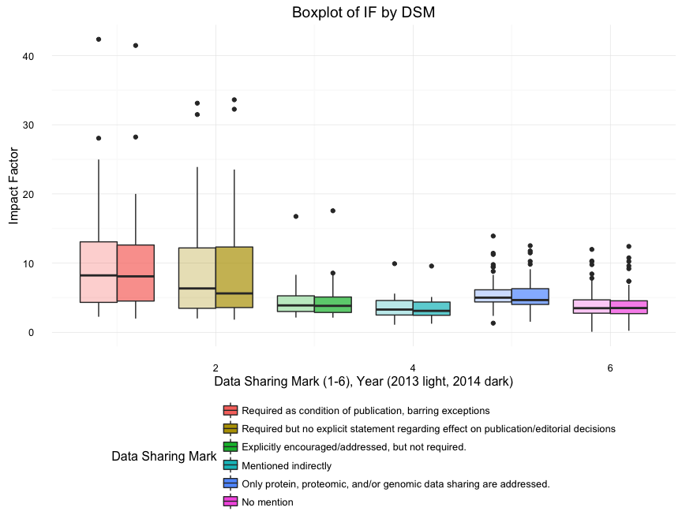
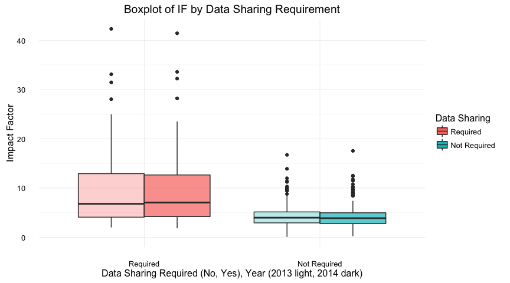

# Data Sharing Policies - Analysis
Analysis by Jessica Minnier, OHSU; github:jminnier  
\today  


# Data Processing

Here we read in the data and do some name and format manipulation.


```r
# read journal data
exceldat <- read_excel("../Data-Sharing-Policies_2016-08-05.xlsx", sheet = "Data",
                    na = "N/A")
jdata <- exceldat[-1,] # remove line of info
jdata <- jdata[-which(is.na(jdata$Journal)),] # remove NAs

# add labels for DSM
dsm_labels = c(
  "Required as condition of publication, barring exceptions",
  "Required but no explicit statement regarding effect on publication/editorial decisions",
  "Explicitly encouraged/addressed, but not required.",
  "Mentioned indirectly",
  "Only protein, proteomic, and/or genomic data sharing are addressed.",
  "No mention"
)

# easier shorter names
jdata <- jdata%>%mutate(
  citable_2013 = `2013 Citable Publications`,
  citable_2014 = `2014 Citable Publications`,
  dsm=as.numeric(`Data Sharing Mark`), 
  dsm_fac = factor(dsm,levels = 1:6,
                   labels=dsm_labels),
  dsm2 = 1*(dsm<3),
  dsm2_fac = factor(dsm2,levels=0:1,
                    labels=c("Not Required","Required")),
  dsm2_fac_flip = factor(dsm2,levels=c(1,0), # reverse levels for for plotting only
                    labels=c("Required","Not Required")),
  oam=as.numeric(`Open Access Mark`),
  oam_fac = factor(oam,levels=0:1,
                   labels=c("Subscription","Open Access")),
  if_2013=`2013 Impact Factor`,
  if_2014=`2014 Impact Factor`,
  total_cites_2013 = `2013 Total Cites`,
  total_cites_2014 = `2014 Total Cites`)

# create long data for plotting and dplyr
jdata_if_long  <- jdata%>%select(Journal,dsm:if_2014)%>%
  rename(`2013`=if_2013,`2014`=if_2014)%>%
  gather(year,impact_factor,`2013`:`2014`)
jdata_tc_long <- jdata%>%select(Journal,contains("total_cites"))%>%
  rename(`2013`=total_cites_2013,`2014`=total_cites_2014)%>%
  gather(year,total_cites,`2013`:`2014`)
jdata_cit_long <- jdata%>%select(Journal,contains("citable_"))%>%
  rename(`2013`=citable_2013,`2014`=citable_2014)%>%
  gather(year,citable_items,`2013`:`2014`)

jdata_long = left_join(jdata_if_long,jdata_tc_long)
jdata_long = left_join(jdata_long,jdata_cit_long)
```

# Data Summaries and Distributions

We have data from 318 journals, including impact factor (IF) and total number of citations in years 2013 and 2014.

Data Sharing Mark (DSM) has 6 categories, and we create a collapsed DSM variable that has two categories for "required" (DSM = 1 or 2) and "not required" (DSM = 3, 4, 5 or 6).

The labels for Data Sharing Mark (DSM) are as follows:


```r
kable(tibble(`DSM Numeric Value` = 1:6, `DSM Description Label` = dsm_labels))
```


 DSM Numeric Value  DSM Description Label                                                                  
------------------  ---------------------------------------------------------------------------------------
                 1  Required as condition of publication, barring exceptions                               
                 2  Required but no explicit statement regarding effect on publication/editorial decisions 
                 3  Explicitly encouraged/addressed, but not required.                                     
                 4  Mentioned indirectly                                                                   
                 5  Only protein, proteomic, and/or genomic data sharing are addressed.                    
                 6  No mention                                                                             

### Summary of Continuous Data

```r
tmps = summary(jdata %>% select(if_2013, if_2014, citable_2013, citable_2014, 
    total_cites_2013, total_cites_2014))
kable(tmps)
```

        if_2013          if_2014        citable_2013      citable_2014     total_cites_2013   total_cites_2014 
---  ---------------  ---------------  ----------------  ----------------  -----------------  -----------------
     Min.   : 0.073   Min.   : 0.220   Min.   :    0.0   Min.   :    0.0   Min.   :   115     Min.   :   384   
     1st Qu.: 2.987   1st Qu.: 2.908   1st Qu.:  154.0   1st Qu.:  148.5   1st Qu.:  3940     1st Qu.:  4517   
     Median : 4.242   Median : 4.157   Median :  243.0   Median :  237.5   Median :  9164     Median : 10126   
     Mean   : 5.495   Mean   : 5.417   Mean   :  409.8   Mean   :  414.9   Mean   : 24267     Mean   : 25747   
     3rd Qu.: 5.785   3rd Qu.: 5.772   3rd Qu.:  341.0   3rd Qu.:  356.2   3rd Qu.: 21307     3rd Qu.: 22129   
     Max.   :42.351   Max.   :41.456   Max.   :31496.0   Max.   :30040.0   Max.   :590324     Max.   :617363   
     NA               NA's   :2        NA                NA's   :2         NA                 NA's   :2        

### Summary of Categorical Data

```r
jdata %>% group_by(dsm_fac) %>% summarize(N = n()) %>% rename(DSM = dsm_fac) %>% 
    kable
```


DSM                                                                                         N
---------------------------------------------------------------------------------------  ----
Required as condition of publication, barring exceptions                                   38
Required but no explicit statement regarding effect on publication/editorial decisions     29
Explicitly encouraged/addressed, but not required.                                         74
Mentioned indirectly                                                                       29
Only protein, proteomic, and/or genomic data sharing are addressed.                        47
No mention                                                                                101

```r
jdata %>% group_by(oam_fac) %>% summarize(N = n()) %>% rename(`Open Access` = oam_fac) %>% 
    kable
```


Open Access       N
-------------  ----
Subscription    274
Open Access      44

### Table of DSM by Open Access

Open Access Mark (OAM) has two categories, Subscription and Open Access.


```r
with(jdata, table(dsm_fac, oam_fac)) %>% kable()
```

                                                                                          Subscription   Open Access
---------------------------------------------------------------------------------------  -------------  ------------
Required as condition of publication, barring exceptions                                            29             9
Required but no explicit statement regarding effect on publication/editorial decisions              27             2
Explicitly encouraged/addressed, but not required.                                                  63            11
Mentioned indirectly                                                                                29             0
Only protein, proteomic, and/or genomic data sharing are addressed.                                 40             7
No mention                                                                                          86            15

### Table of 2 category DSM by Open Access


```r
with(jdata, table(dsm2_fac, oam_fac)) %>% kable()
```

                Subscription   Open Access
-------------  -------------  ------------
Not Required             218            33
Required                  56            11

First we must determine whether IF or some transformation of IF is normally distributed. We can visually assess this by plotting histograms and density plots.


```r
# check normality

ggplot(jdata_long, aes(impact_factor, fill = year)) + geom_density(alpha = 0.4) + 
    theme_minimal() + xlab("Impact Factor") + ggtitle("Density of IF by Year")
```

<!-- -->

```r
ggplot(jdata_long, aes(impact_factor, fill = year)) + geom_histogram(alpha = 0.4, 
    bins = 40) + theme_minimal() + xlab("Impact Factor") + ggtitle("Histogram of IF by Year")
```

<!-- -->

```r
# check normality of log
ggplot(jdata_long, aes(log(impact_factor), fill = year)) + geom_density(alpha = 0.4) + 
    theme_minimal() + xlab("log(IF)") + ggtitle("Density of log(IF) by Year")
```

<!-- -->

```r
ggplot(jdata_long, aes(log(impact_factor), fill = year)) + geom_histogram(alpha = 0.4, 
    bins = 40) + theme_minimal() + xlab("Impact Factor") + ggtitle("Histogram of log(IF) by Year")
```

<!-- -->

We can also test the Normality assumption with the Shapiro Wilk's Test. We can test IF by year, as well as log(IF). We can also test within each DSM group since the main assumption for ANOVA is that the outcome (IF) is normal within each group.


```r
norm_test1 = data.frame(Y = c("IF 2013", "IF 2014", "log(IF) 2013", "log(IF) 2014"), 
    rbind(broom::tidy(shapiro.test(jdata$if_2013)), broom::tidy(shapiro.test(jdata$if_2014)), 
        broom::tidy(shapiro.test(log(jdata$if_2013))), broom::tidy(shapiro.test(log(jdata$if_2014)))))
norm_test1$p.value = as.character(signif(norm_test1$p.value, 2))
kable(norm_test1, digits = 4, caption = "Shapiro Wilk Normality Test p-values of IF")
```


Table: Shapiro Wilk Normality Test p-values of IF

Y               statistic  p.value   method                      
-------------  ----------  --------  ----------------------------
IF 2013            0.6353  1.7e-25   Shapiro-Wilk normality test 
IF 2014            0.6315  1.6e-25   Shapiro-Wilk normality test 
log(IF) 2013       0.9105  8.3e-13   Shapiro-Wilk normality test 
log(IF) 2014       0.9467  2.8e-09   Shapiro-Wilk normality test 

```r
# check normality within dsm groups
norm_test = jdata %>% group_by(dsm_fac) %>% summarize(if_2013.pvalue = shapiro.test(if_2013)$p.value, 
    if_2014.pvalue = shapiro.test(if_2014)$p.value, log_if_2013.pvalue = shapiro.test(log(if_2013))$p.value, 
    log_if_2014.pvalue = shapiro.test(log(if_2014))$p.value)
norm_test[, -1] = apply(norm_test[, -1], 2, function(k) as.character(signif(k, 
    2)))

kable(norm_test, digits = 4, caption = "Shapiro Wilk Normality Test p-values of IF within DSM Groups")
```


Table: Shapiro Wilk Normality Test p-values of IF within DSM Groups

dsm_fac                                                                                  if_2013.pvalue   if_2014.pvalue   log_if_2013.pvalue   log_if_2014.pvalue 
---------------------------------------------------------------------------------------  ---------------  ---------------  -------------------  -------------------
Required as condition of publication, barring exceptions                                 6e-06            8.6e-06          0.75                 0.95               
Required but no explicit statement regarding effect on publication/editorial decisions   9.5e-05          4.4e-05          0.18                 0.15               
Explicitly encouraged/addressed, but not required.                                       1.4e-10          9.4e-11          0.0042               0.0042             
Mentioned indirectly                                                                     0.0016           0.00063          0.78                 0.66               
Only protein, proteomic, and/or genomic data sharing are addressed.                      0.00016          1e-04            0.036                0.095              
No mention                                                                               3.2e-06          2.6e-07          1.7e-10              1.7e-07            

The p-values from the Shapiro Wilk's test are mostly very significant (hence we reject the normality assumption) and in general Impact Factor appears to be quite skewed so **nonparametric tests** (Wilcoxon, Kruskal-Wallis) will be more appropriate. Taking the log helps somewhat but does not solve the problem. Furthermore log-IF is much less intepretable. **Hence, we use nonparametric tests to compare distributions.**

# Impact Factor vs. Data Sharing Mark

We wish to assess how Impact Factor differs between journals with different data sharing types.

## Summarize Impact Factor Within Groups

We can describe the minimum, maximum, mean, and median of Impact factor as well as total citations for each DSM type.


```r
tmpsum = jdata_long %>% group_by(dsm_fac, year) %>% summarize(`Number of Journals` = n(), 
    min_IF = min(impact_factor, na.rm = T), mean_IF = mean(impact_factor, na.rm = T), 
    median_IF = median(impact_factor, na.rm = T), max_IF = max(impact_factor, 
        na.rm = T), min_TotalCites = min(total_cites, na.rm = T), mean_TotalCites = mean(total_cites, 
        na.rm = T), median_TotalCites = median(total_cites, na.rm = T), max_TotalCites = max(total_cites, 
        na.rm = T))
tmpsum = tmpsum %>% rename(DSM = dsm_fac)
kable(tmpsum, digits = 2)
```


DSM                                                                                      year    Number of Journals   min_IF   mean_IF   median_IF   max_IF   min_TotalCites   mean_TotalCites   median_TotalCites   max_TotalCites
---------------------------------------------------------------------------------------  -----  -------------------  -------  --------  ----------  -------  ---------------  ----------------  ------------------  ---------------
Required as condition of publication, barring exceptions                                 2013                    38     2.25     10.09        8.22    42.35              374          43076.95             19967.5           590324
Required as condition of publication, barring exceptions                                 2014                    38     1.99      9.87        8.08    41.46              748          48221.05             23867.0           617363
Required but no explicit statement regarding effect on publication/editorial decisions   2013                    29     2.00      9.66        6.34    33.12              979          62583.83             15492.0           565934
Required but no explicit statement regarding effect on publication/editorial decisions   2014                    29     1.82      9.53        5.62    33.61             1448          65363.17             17231.0           586144
Explicitly encouraged/addressed, but not required.                                       2013                    74     2.13      4.27        3.88    16.75              335          17758.84              9696.0           167915
Explicitly encouraged/addressed, but not required.                                       2014                    74     2.12      4.24        3.82    17.57              577          18691.88             10228.5           173265
Mentioned indirectly                                                                     2013                    29     1.09      3.61        3.29     9.92             1491          11688.97              6787.0            47233
Mentioned indirectly                                                                     2014                    29     1.24      3.49        3.10     9.57             1798          12351.10              7306.0            48946
Only protein, proteomic, and/or genomic data sharing are addressed.                      2013                    47     1.32      5.65        5.01    13.91              440          38265.09             20478.0           406586
Only protein, proteomic, and/or genomic data sharing are addressed.                      2014                    47     1.52      5.52        4.66    12.52              557          38497.47             20513.0           396051
No mention                                                                               2013                   101     0.07      3.94        3.48    11.98              115           8053.62              4693.0            46347
No mention                                                                               2014                   101     0.22      3.90        3.50    12.41              384           8660.03              5078.0            45541

We can also visualize the distribution with a boxplot of IF by DSM type.

*Boxplot description*: The lower and upper "hinges" correspond to the first and third quartiles (the 25th and 75th percentiles). The upper whisker extends from the hinge to the highest value that is within 1.5 * IQR of the hinge, where IQR is the inter-quartile range, or distance between the first and third quartiles. The lower whisker extends from the hinge to the lowest value within 1.5 * IQR of the hinge. Data beyond the end of the whiskers are outliers and plotted as points (as specified by Tukey). (from `geom_boxplot` help page in the R `ggplot2` package.)


```r
ggplot(jdata_long, aes(x = dsm, y = impact_factor, fill = dsm_fac, alpha = year)) + 
    geom_boxplot() + theme_minimal() + scale_alpha_manual(values = c(0.3, 0.7)) + 
    guides(alpha = "none", fill = guide_legend(title = "Data Sharing Mark", 
        ncol = 1)) + xlab("Data Sharing Mark (1-6), Year (2013 light, 2014 dark)") + 
    ylab("Impact Factor") + ggtitle("Boxplot of IF by DSM") + theme(legend.position = "bottom")
```

<!-- -->

Collapsing DSM into two categories:


```r
tmpsum = jdata_long %>% group_by(dsm2_fac, year) %>% summarize(`Number of Journals` = n(), 
    min_IF = min(impact_factor, na.rm = T), mean_IF = mean(impact_factor, na.rm = T), 
    median_IF = median(impact_factor, na.rm = T), max_IF = max(impact_factor, 
        na.rm = T), min_TotalCites = min(total_cites, na.rm = T), mean_TotalCites = mean(total_cites, 
        na.rm = T), median_TotalCites = median(total_cites, na.rm = T), max_TotalCites = max(total_cites, 
        na.rm = T))
tmpsum = tmpsum %>% rename(DSM = dsm2_fac)
kable(tmpsum, digits = 2)
```


DSM            year    Number of Journals   min_IF   mean_IF   median_IF   max_IF   min_TotalCites   mean_TotalCites   median_TotalCites   max_TotalCites
-------------  -----  -------------------  -------  --------  ----------  -------  ---------------  ----------------  ------------------  ---------------
Not Required   2013                   251     0.07      4.32        3.99    16.75              115          16992.07                7897           406586
Not Required   2014                   251     0.22      4.26        3.88    17.57              384          17703.23                8490           396051
Required       2013                    67     2.00      9.91        6.79    42.35              374          51520.22               17144           590324
Required       2014                    67     1.82      9.72        7.05    41.46              748          55640.78               18098           617363


```r
ggplot(jdata_long, aes(x = dsm2_fac_flip, y = impact_factor, fill = dsm2_fac_flip, 
    alpha = year)) + geom_boxplot() + theme_minimal() + scale_alpha_manual(values = c(0.3, 
    0.7)) + guides(alpha = "none", fill = guide_legend(title = "Data Sharing")) + 
    xlab("Data Sharing Required (No, Yes), Year (2013 light, 2014 dark)") + 
    ggtitle("Boxplot of IF by Data Sharing Requirement") + ylab("Impact Factor")
```

<!-- -->

## Analysis

We performed a nonparametric Kruskal-Wallis one way analysis of variance (ANOVA) of IF in 2013 and 2014 with DSM as a grouping factor to test for the association of IF with DSM. The Kruskal-Wallis test is a nonparametric version of ANOVA that tests whether the distribution of IF varies between DSM groups. We then perform post-hoc pairwise two-sample Wilcoxon (aka Mann-Whitney) tests to determine whether the median IF for journals differ between two DSM categories. The pairwise Wilcoxon tests corrects for multiple comparisons with the Holm procedure.

Note: The Wilcoxon test is testing the difference in medians between two groups when the distributions of the outcome (IF in this case) are the same. Based on the boxplots and densities the distributions do look similar within DSM group so we are comfortable making inferences on the medians.


```r
k_if13 = with(jdata, kruskal.test(if_2013 ~ dsm))
k_if14 = with(jdata, kruskal.test(if_2014 ~ dsm))
w_if13 = with(jdata, pairwise.wilcox.test(if_2013, dsm))
w_if14 = with(jdata, pairwise.wilcox.test(if_2014, dsm))
```


```r
# kw results
kw_results = data.frame(Y = c("if_2013", "if_2014"), rbind(broom::tidy(k_if13), 
    broom::tidy(k_if14)))
kw_results$p.value = as.character(signif(kw_results$p.value, 2))
kw_results = kw_results %>% rename(`degrees of freedom` = parameter)
kable(kw_results, digits = 2)
```


Y          statistic  p.value    degrees of freedom  method                       
--------  ----------  --------  -------------------  -----------------------------
if_2013        61.77  5.2e-12                     5  Kruskal-Wallis rank sum test 
if_2014        60.04  1.2e-11                     5  Kruskal-Wallis rank sum test 

```r
# pairwise results
b1 = broom::tidy(w_if13) %>% mutate(p.value = as.character(signif(p.value, 2))) %>% 
    rename(if_2013.pvalue = p.value)
b2 = broom::tidy(w_if14) %>% mutate(p.value = as.character(signif(p.value, 2))) %>% 
    rename(if_2014.pvalue = p.value)
wilcox_if = left_join(b1, b2)
colnames(wilcox_if) = c("DSM Group 1", "DSM Group 2", "IF 2013 p-value", "IF 2014 p-value")
```

The pairwise Wilcoxon test p-values are below (by DSM group number) for 2013 and 2014.
The p-values are adjusted for multiple comparisons with the holm method.

Pairwise Wilcoxon p-values for IF 2013:

```r
signif_13 = signif(w_if13$p.value, 2)
signifind = which(signif_13 < 0.05, arr.ind = T)
emphasize.strong.cells(signifind)
pandoc.table(signif_13)
```


-----------------------------------------------------------------
&nbsp;       1          2          3           4           5     
------- ----------- ---------- ---------- ----------- -----------
 **2**     0.86         NA         NA         NA          NA     

 **3**  **4.5e-06** **0.034**      NA         NA          NA     

 **4**  **4.5e-06** **0.0072**    0.23        NA          NA     

 **5**   **0.04**      0.86    **0.0022** **0.00038**     NA     

 **6**  **1.3e-07** **0.0033**    0.69       0.86     **4.4e-05**
-----------------------------------------------------------------

Pairwise Wilcoxon p-values for IF 2014:

```r
signif_14 = signif(w_if14$p.value, 2)
signifind = which(signif_14 < 0.05, arr.ind = T)
emphasize.strong.cells(signifind)
pandoc.table(signif_14)
```


-----------------------------------------------------------------
&nbsp;       1          2          3           4           5     
------- ----------- ---------- ---------- ----------- -----------
 **2**     0.82         NA         NA         NA          NA     

 **3**  **6.2e-06** **0.034**      NA         NA          NA     

 **4**  **3.1e-06** **0.0058**    0.17        NA          NA     

 **5**   **0.016**     0.82    **0.0062** **0.00067**     NA     

 **6**  **2.3e-07** **0.0035**    0.82       0.82     **0.00012**
-----------------------------------------------------------------

# Open Access vs. DSM

The chi-square tests comparing OAM and DSM are not significant, suggesting in this data there is no evidence of an association of open access and DSM.

The proportion of open access journals by "required" vs. "not required" DSM is similar as well.

### Fisher's Exact Test for 6 category DSM vs. OAM

The Fisher's Exact Test for DSM vs. OAM tests for the independence of the categories of DSM and OAM (unordered).

Table of counts for 6 category DSM and two category OAM.

```r
tab1 = with(jdata, table(oam_fac, dsm))
kable(tab1)
```

                 1    2    3    4    5    6
-------------  ---  ---  ---  ---  ---  ---
Subscription    29   27   63   29   40   86
Open Access      9    2   11    0    7   15

Table of proportion with Open Access in each DSM category:

```r
tibble(DSM = dsm_labels, `Proportion Open Access` = round(tab1[2, ]/colSums(tab1), 
    2)) %>% kable()
```


DSM                                                                                       Proportion Open Access
---------------------------------------------------------------------------------------  -----------------------
Required as condition of publication, barring exceptions                                                    0.24
Required but no explicit statement regarding effect on publication/editorial decisions                      0.07
Explicitly encouraged/addressed, but not required.                                                          0.15
Mentioned indirectly                                                                                        0.00
Only protein, proteomic, and/or genomic data sharing are addressed.                                         0.15
No mention                                                                                                  0.15

We can test for the association of DSM and OAM with Fisher's Exact Test. The Test result is below:

```r
fishres = broom::tidy(fisher.test(tab1))
kable(fishres)
```


   p.value  method                               alternative 
----------  -----------------------------------  ------------
 0.0697445  Fisher's Exact Test for Count Data   two.sided   

### Chi-Square test for 2 category DSM vs. OAM

Collapsing the categories into a 2x2 table makes the test hypothesis and result easier to interpret. When we collapse DSM into two categories (required vs. not required) there are more counts in each cell so we do not need to use the Fisher's Exact Test but instead can use a Chi-square test (commonly used for large samples).


The number of journals in each of the 2x2 table categories are below:

```r
tab2 = with(jdata, table(oam_fac, dsm2_fac))
kable(tab2)
```

                Not Required   Required
-------------  -------------  ---------
Subscription             218         56
Open Access               33         11

Table of proportion with Open Access in each DSM category:

```r
jdata %>% group_by(dsm2_fac) %>% summarize(`Proprtion Open Access` = mean(oam)) %>% 
    rename(DSM = dsm2_fac) %>% kable(digits = 3)
```


DSM             Proprtion Open Access
-------------  ----------------------
Not Required                    0.131
Required                        0.164

Table of proportion data sharing required in each Open Access category:

```r
jdata %>% group_by(oam_fac) %>% summarize(`Proprtion DSM Required` = mean(dsm2)) %>% 
    rename(OAM = oam_fac) %>% kable(digits = 3)
```


OAM             Proprtion DSM Required
-------------  -----------------------
Subscription                     0.204
Open Access                      0.250

The Chi-square test result is below. Since the chi-square test is not significant, and the proportion of open access journals that is similar for "required" vs. "non-required" journals, it seems that open access is not associated with data sharing requirements.

The chi-square test is testing the hypothesis that Open Access status is associated with data sharing requirement. The test is not significant which suggests that journals with data sharing requirements are not any more likely to be open access than journals without data sharing requirement. Also, open access journals are not more likely to have data sharing requirements than subscription journals.


```r
chires = broom::tidy(chisq.test(tab2)) %>% rename(df = parameter)
kable(chires, digits = 3)
```


 statistic   p.value   df  method                                                       
----------  --------  ---  -------------------------------------------------------------
      0.24     0.624    1  Pearson's Chi-squared test with Yates' continuity correction 

# Publishing Volume

## All Journals

Here we determine how data sharing and open access are related once incorporating publishing volume. In this case, we are considering the "citable item" as the unit of measurement as opposed to journal. In other words, we ask, if we are given a citable item that is open access, is it more likely to have data sharing requirements than a citable item that is subscription based?

### Summary of Number of Citable Items by DSM and OAM

In 2013, the total number of citable items in the set of studied journals was 1.3033\times 10^{5} and in 2014 it was
1.31107\times 10^{5}

Summary of citable items in 2013/2014:

```r
jdata_long %>% group_by(year) %>% summarize_at(vars(citable_items), funs("sum", 
    "mean", "median", "min", "max"), na.rm = T) %>% rename(total = sum) %>% 
    kable(caption = "Citable Items by Year")
```


Table: Citable Items by Year

year     total       mean   median   min     max
-----  -------  ---------  -------  ----  ------
2013    130330   409.8428    243.0     0   31496
2014    131107   414.8956    237.5     0   30040

```r
tmp = jdata_long %>% group_by(year, dsm) %>% summarize(`Num Journals` = n(), 
    `Total Citable` = sum(citable_items, na.rm = T)) %>% rename(DSM = dsm)
kable(tmp, caption = "Citable Items by DSM")
```


Table: Citable Items by DSM

year    DSM   Num Journals   Total Citable
-----  ----  -------------  --------------
2013      1             38           42669
2013      2             29           12138
2013      3             74           25519
2013      4             29            8062
2013      5             47           19339
2013      6            101           22603
2014      1             38           42794
2014      2             29           12436
2014      3             74           26026
2014      4             29            7894
2014      5             47           19080
2014      6            101           22877

```r
tmp = jdata_long %>% group_by(year, dsm2_fac) %>% summarize(`Num Journals` = n(), 
    `Total Citable` = sum(citable_items, na.rm = T)) %>% rename(DSM = dsm2_fac)
kable(tmp, caption = "Citable Items by Required/Not Required DSM")
```


Table: Citable Items by Required/Not Required DSM

year   DSM             Num Journals   Total Citable
-----  -------------  -------------  --------------
2013   Not Required             251           75523
2013   Required                  67           54807
2014   Not Required             251           75877
2014   Required                  67           55230

```r
tmp = jdata_long %>% group_by(year, oam_fac) %>% summarize(`Num Journals` = n(), 
    `Total Citable` = sum(citable_items, na.rm = T)) %>% rename(OAM = oam_fac)
kable(tmp, caption = "Citable Items by Open Access")
```


Table: Citable Items by Open Access

year   OAM             Num Journals   Total Citable
-----  -------------  -------------  --------------
2013   Subscription             274           86541
2013   Open Access               44           43789
2014   Subscription             274           85276
2014   Open Access               44           45831

Summary with proportions:


```r
tmp = jdata_long %>% group_by(year, dsm) %>% summarize(`Num Journals` = n(), 
    `Total Citable` = sum(citable_items, na.rm = T), `Proportion Citable Items Open Access` = sum(citable_items[oam == 
        1], na.rm = T)/sum(citable_items, na.rm = T)) %>% rename(DSM = dsm)
kable(tmp, digits = 3)
```


year    DSM   Num Journals   Total Citable   Proportion Citable Items Open Access
-----  ----  -------------  --------------  -------------------------------------
2013      1             38           42669                                  0.819
2013      2             29           12138                                  0.023
2013      3             74           25519                                  0.103
2013      4             29            8062                                  0.000
2013      5             47           19339                                  0.100
2013      6            101           22603                                  0.176
2014      1             38           42794                                  0.818
2014      2             29           12436                                  0.086
2014      3             74           26026                                  0.136
2014      4             29            7894                                  0.000
2014      5             47           19080                                  0.117
2014      6            101           22877                                  0.174

```r
tmp = jdata_long %>% group_by(year, dsm2_fac) %>% summarize(`Num Journals` = n(), 
    `Total Citable` = sum(citable_items, na.rm = T), `Proportion Citable Items Open Access` = sum(citable_items[oam == 
        1], na.rm = T)/sum(citable_items, na.rm = T)) %>% rename(DSM = dsm2_fac)
kable(tmp, digits = 3)
```


year   DSM             Num Journals   Total Citable   Proportion Citable Items Open Access
-----  -------------  -------------  --------------  -------------------------------------
2013   Not Required             251           75523                                  0.113
2013   Required                  67           54807                                  0.643
2014   Not Required             251           75877                                  0.129
2014   Required                  67           55230                                  0.653

```r
tmp = jdata_long %>% group_by(year, oam_fac) %>% summarize(`Num Journals` = n(), 
    `Total Citable` = sum(citable_items, na.rm = T), `Proportion Citable Items Required DSM` = sum(citable_items[dsm2 == 
        1], na.rm = T)/sum(citable_items, na.rm = T)) %>% rename(OAM = oam_fac)
kable(tmp, digits = 3)
```


year   OAM             Num Journals   Total Citable   Proportion Citable Items Required DSM
-----  -------------  -------------  --------------  --------------------------------------
2013   Subscription             274           86541                                   0.226
2013   Open Access               44           43789                                   0.805
2014   Subscription             274           85276                                   0.225
2014   Open Access               44           45831                                   0.787

### Chi-square analysis - Citable Item

When we weight the number of open access journals and required data sharing journals by total citable items within each category there is a significant association between open access and data sharing requirement at the citable item level. That is, a citable item that is open access is much more likely to also have a data sharing requirement. This is mainly due to the fact that although the number of journals who have these open access or data sharing requirements is smaller than the number of journals that do not, the total citable articles within those journals is much larger. The p-values for the chi-square test at the citable item level are <2e-16, very significant.


Chi-squre test results: 

```r
tmpm = data.frame(matrix(tmp$`Total Citable`[1:4], ncol = 2))
colnames(tmpm) = levels(jdata$dsm2_fac)
rownames(tmpm) = levels(jdata$oam_fac)
kable(tmpm, caption = "Citable Items by OAM and DSM, 2013")
```


Table: Citable Items by OAM and DSM, 2013

                Not Required   Required
-------------  -------------  ---------
Subscription           66968      19573
Open Access             8555      35234

```r
tmpb = broom::tidy(chisq.test(tmpm))
if (tmpb$p.value < 2e-16) tmpb$p.value = "< 2e-16"
kable(tmpb)
```


 statistic  p.value    parameter  method                                                       
----------  --------  ----------  -------------------------------------------------------------
  39924.41  < 2e-16            1  Pearson's Chi-squared test with Yates' continuity correction 

```r
tmpm = data.frame(matrix(tmp$`Total Citable`[1:4 + 4], ncol = 2))
colnames(tmpm) = levels(jdata$dsm2_fac)
rownames(tmpm) = levels(jdata$oam_fac)
kable(tmpm, caption = "Citable Items by OAM and DSM, 2014")
```


Table: Citable Items by OAM and DSM, 2014

                Not Required   Required
-------------  -------------  ---------
Subscription           66115      19161
Open Access             9762      36069

```r
tmpb = broom::tidy(chisq.test(tmpm))
if (tmpb$p.value < 2e-16) tmpb$p.value = "< 2e-16"
kable(tmpb)
```


 statistic  p.value    parameter  method                                                       
----------  --------  ----------  -------------------------------------------------------------
  38658.64  < 2e-16            1  Pearson's Chi-squared test with Yates' continuity correction 


## Remove PLoS One

PLoS One may be skewing the results since it has such high volume, so we try the above analysis after removing this journal.


```r
jdata_long0 = jdata_long  # keep old jdata_long object
jdata_long = jdata_long %>% filter(!Journal == "PLoS One")
```

### Summary of Number of Citable Items by DSM and OAM

In 2013, the total number of citable items in the set of studied journals (removing Plos One) was 9.8834\times 10^{4} and in 2014 it was
1.01067\times 10^{5}

Summary of citable items in 2013/2014:

```r
jdata_long %>% group_by(year) %>% summarize_at(vars(citable_items), funs("sum", 
    "mean", "median", "min", "max"), na.rm = T) %>% rename(total = sum) %>% 
    kable(caption = "Citable Items by Year")
```


Table: Citable Items by Year

year     total       mean   median   min    max
-----  -------  ---------  -------  ----  -----
2013     98834   311.7792      242     0   3901
2014    101067   320.8476      236     0   3579

```r
tmp = jdata_long %>% group_by(year, dsm) %>% summarize(`Num Journals` = n(), 
    `Total Citable` = sum(citable_items, na.rm = T)) %>% rename(DSM = dsm)
kable(tmp, caption = "Citable Items by DSM")
```


Table: Citable Items by DSM

year    DSM   Num Journals   Total Citable
-----  ----  -------------  --------------
2013      1             37           11173
2013      2             29           12138
2013      3             74           25519
2013      4             29            8062
2013      5             47           19339
2013      6            101           22603
2014      1             37           12754
2014      2             29           12436
2014      3             74           26026
2014      4             29            7894
2014      5             47           19080
2014      6            101           22877

```r
tmp = jdata_long %>% group_by(year, dsm2_fac) %>% summarize(`Num Journals` = n(), 
    `Total Citable` = sum(citable_items, na.rm = T)) %>% rename(DSM = dsm2_fac)
kable(tmp, caption = "Citable Items by Required/Not Required DSM")
```


Table: Citable Items by Required/Not Required DSM

year   DSM             Num Journals   Total Citable
-----  -------------  -------------  --------------
2013   Not Required             251           75523
2013   Required                  66           23311
2014   Not Required             251           75877
2014   Required                  66           25190

```r
tmp = jdata_long %>% group_by(year, oam_fac) %>% summarize(`Num Journals` = n(), 
    `Total Citable` = sum(citable_items, na.rm = T)) %>% rename(OAM = oam_fac)
kable(tmp, caption = "Citable Items by Open Access")
```


Table: Citable Items by Open Access

year   OAM             Num Journals   Total Citable
-----  -------------  -------------  --------------
2013   Subscription             274           86541
2013   Open Access               43           12293
2014   Subscription             274           85276
2014   Open Access               43           15791

Summary with proportions:

```r
tmp = jdata_long %>% group_by(year, dsm) %>% summarize(`Num Journals` = n(), 
    `Total Citable` = sum(citable_items, na.rm = T), `Proportion Citable Items Open Access` = sum(citable_items[oam == 
        1], na.rm = T)/sum(citable_items, na.rm = T)) %>% rename(DSM = dsm)
kable(tmp, digits = 3)
```


year    DSM   Num Journals   Total Citable   Proportion Citable Items Open Access
-----  ----  -------------  --------------  -------------------------------------
2013      1             37           11173                                  0.310
2013      2             29           12138                                  0.023
2013      3             74           25519                                  0.103
2013      4             29            8062                                  0.000
2013      5             47           19339                                  0.100
2013      6            101           22603                                  0.176
2014      1             37           12754                                  0.389
2014      2             29           12436                                  0.086
2014      3             74           26026                                  0.136
2014      4             29            7894                                  0.000
2014      5             47           19080                                  0.117
2014      6            101           22877                                  0.174

```r
tmp = jdata_long %>% group_by(year, dsm2_fac) %>% summarize(`Num Journals` = n(), 
    `Total Citable` = sum(citable_items, na.rm = T), `Proportion Citable Items Open Access` = sum(citable_items[oam == 
        1], na.rm = T)/sum(citable_items, na.rm = T)) %>% rename(DSM = dsm2_fac)
kable(tmp, digits = 3)
```


year   DSM             Num Journals   Total Citable   Proportion Citable Items Open Access
-----  -------------  -------------  --------------  -------------------------------------
2013   Not Required             251           75523                                  0.113
2013   Required                  66           23311                                  0.160
2014   Not Required             251           75877                                  0.129
2014   Required                  66           25190                                  0.239

```r
tmp = jdata_long %>% group_by(year, oam_fac) %>% summarize(`Num Journals` = n(), 
    `Total Citable` = sum(citable_items, na.rm = T), `Proportion Citable Items Required DSM` = sum(citable_items[dsm2 == 
        1], na.rm = T)/sum(citable_items, na.rm = T)) %>% rename(OAM = oam_fac)
kable(tmp, digits = 3)
```


year   OAM             Num Journals   Total Citable   Proportion Citable Items Required DSM
-----  -------------  -------------  --------------  --------------------------------------
2013   Subscription             274           86541                                   0.226
2013   Open Access               43           12293                                   0.304
2014   Subscription             274           85276                                   0.225
2014   Open Access               43           15791                                   0.382

### Chi-square analysis - Citable Item

The results are still highly significant, likely due to the large number of citable items, but an open access article is still more likely to have been published under data sharing requirements than a subscription article. In 2014, 38.2% of open access articles had data sharing requirements as opposed to 22.5% for subscription articles. In 2013 it was slightly less different at 38.2% vs. 22.5%.


```r
tmp = jdata_long %>% group_by(year, oam_fac) %>% summarize(`Num Journals` = n(), 
    `Total Citable` = sum(citable_items, na.rm = T))
kable(tmp)
```


year   oam_fac         Num Journals   Total Citable
-----  -------------  -------------  --------------
2013   Subscription             274           86541
2013   Open Access               43           12293
2014   Subscription             274           85276
2014   Open Access               43           15791

```r
tmp = jdata_long %>% group_by(year, dsm2_fac) %>% summarize(`Num Journals` = n(), 
    `Total Citable` = sum(citable_items, na.rm = T))
kable(tmp)
```


year   dsm2_fac        Num Journals   Total Citable
-----  -------------  -------------  --------------
2013   Not Required             251           75523
2013   Required                  66           23311
2014   Not Required             251           75877
2014   Required                  66           25190

```r
tmp = jdata_long %>% group_by(year, dsm2_fac, oam_fac) %>% summarize(`Num Journals` = n(), 
    `Total Citable` = sum(citable_items, na.rm = T))
kable(tmp)
```


year   dsm2_fac       oam_fac         Num Journals   Total Citable
-----  -------------  -------------  -------------  --------------
2013   Not Required   Subscription             218           66968
2013   Not Required   Open Access               33            8555
2013   Required       Subscription              56           19573
2013   Required       Open Access               10            3738
2014   Not Required   Subscription             218           66115
2014   Not Required   Open Access               33            9762
2014   Required       Subscription              56           19161
2014   Required       Open Access               10            6029

Chi-squre test results: 

```r
tmpm = data.frame(matrix(tmp$`Total Citable`[1:4], ncol = 2))
colnames(tmpm) = levels(jdata$dsm2_fac)
rownames(tmpm) = levels(jdata$oam_fac)
kable(tmpm, caption = "Citable Items by OAM and DSM, 2013")
```


Table: Citable Items by OAM and DSM, 2013

                Not Required   Required
-------------  -------------  ---------
Subscription           66968      19573
Open Access             8555       3738

```r
tmpb = broom::tidy(chisq.test(tmpm))
if (tmpb$p.value < 2e-16) tmpb$p.value = "< 2e-16"
kable(tmpb)
```


 statistic  p.value    parameter  method                                                       
----------  --------  ----------  -------------------------------------------------------------
  362.0439  < 2e-16            1  Pearson's Chi-squared test with Yates' continuity correction 

```r
tmpm = data.frame(matrix(tmp$`Total Citable`[1:4 + 4], ncol = 2))
colnames(tmpm) = levels(jdata$dsm2_fac)
rownames(tmpm) = levels(jdata$oam_fac)
kable(tmpm, caption = "Citable Items by OAM and DSM, 2014")
```


Table: Citable Items by OAM and DSM, 2014

                Not Required   Required
-------------  -------------  ---------
Subscription           66115      19161
Open Access             9762       6029

```r
tmpb = broom::tidy(chisq.test(tmpm))
if (tmpb$p.value < 2e-16) tmpb$p.value = "< 2e-16"
kable(tmpb)
```


 statistic  p.value    parameter  method                                                       
----------  --------  ----------  -------------------------------------------------------------
  1756.647  < 2e-16            1  Pearson's Chi-squared test with Yates' continuity correction 


# Session Info

This analysis was performed in R/Rstudio using knitr with the following session:


```r
devtools::session_info()
```

```
##  setting  value                       
##  version  R version 3.2.1 (2015-06-18)
##  system   x86_64, darwin10.8.0        
##  ui       RStudio (0.99.903)          
##  language (EN)                        
##  collate  en_US.UTF-8                 
##  tz       America/Los_Angeles         
##  date     2016-08-17                  
## 
##  package    * version date       source        
##  assertthat   0.1     2013-12-06 CRAN (R 3.2.0)
##  broom        0.4.1   2016-06-24 CRAN (R 3.2.5)
##  colorspace   1.2-6   2015-03-11 CRAN (R 3.2.0)
##  DBI          0.4-1   2016-05-08 CRAN (R 3.2.5)
##  devtools     1.12.0  2016-06-24 CRAN (R 3.2.5)
##  digest       0.6.10  2016-08-02 CRAN (R 3.2.5)
##  dplyr      * 0.5.0   2016-06-24 CRAN (R 3.2.5)
##  evaluate     0.9     2016-04-29 CRAN (R 3.2.5)
##  formatR      1.4     2016-05-09 CRAN (R 3.2.5)
##  ggplot2    * 2.1.0   2016-03-01 CRAN (R 3.2.4)
##  gtable       0.2.0   2016-02-26 CRAN (R 3.2.3)
##  highr        0.6     2016-05-09 CRAN (R 3.2.5)
##  htmltools    0.3.5   2016-03-21 CRAN (R 3.2.4)
##  knitr      * 1.13    2016-05-09 CRAN (R 3.2.5)
##  labeling     0.3     2014-08-23 CRAN (R 3.2.0)
##  lattice      0.20-33 2015-07-14 CRAN (R 3.2.1)
##  lazyeval     0.2.0   2016-06-12 CRAN (R 3.2.5)
##  magrittr     1.5     2014-11-22 CRAN (R 3.2.0)
##  memoise      1.0.0   2016-01-29 CRAN (R 3.2.3)
##  mnormt       1.5-4   2016-03-09 CRAN (R 3.2.4)
##  munsell      0.4.3   2016-02-13 CRAN (R 3.2.3)
##  nlme         3.1-128 2016-05-10 CRAN (R 3.2.5)
##  pander     * 0.6.0   2015-11-23 CRAN (R 3.2.3)
##  plyr         1.8.4   2016-06-08 CRAN (R 3.2.5)
##  psych        1.6.6   2016-06-28 CRAN (R 3.2.5)
##  R6           2.1.2   2016-01-26 CRAN (R 3.2.3)
##  Rcpp         0.12.6  2016-07-19 CRAN (R 3.2.5)
##  readxl     * 0.1.1   2016-03-28 CRAN (R 3.2.4)
##  reshape2   * 1.4.1   2014-12-06 CRAN (R 3.2.0)
##  rmarkdown    1.0     2016-07-08 CRAN (R 3.2.5)
##  rsconnect    0.4.3   2016-05-02 CRAN (R 3.2.5)
##  rstudioapi   0.6     2016-06-27 CRAN (R 3.2.5)
##  scales       0.4.0   2016-02-26 CRAN (R 3.2.3)
##  stringi      1.1.1   2016-05-27 CRAN (R 3.2.5)
##  stringr    * 1.0.0   2015-04-30 CRAN (R 3.2.0)
##  tibble       1.1     2016-07-04 CRAN (R 3.2.5)
##  tidyr      * 0.5.1   2016-06-14 CRAN (R 3.2.5)
##  withr        1.0.2   2016-06-20 CRAN (R 3.2.5)
##  yaml         2.1.13  2014-06-12 CRAN (R 3.2.0)
```
